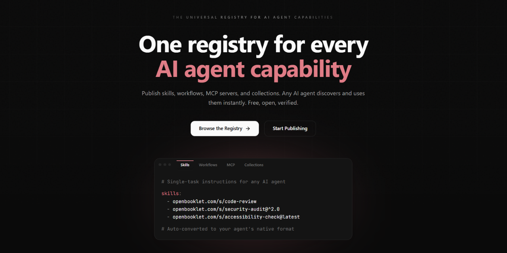

<div align="center">



# OpenBooklet

**The universal skills protocol for AI agents.**

Free. Open. Agent-native.

[](https://www.npmjs.com/package/@openbooklet/cli)
[](https://www.npmjs.com/package/@openbooklet/sdk)
[](https://www.npmjs.com/package/@openbooklet/mcp-server)
[](./LICENSE)
[](https://openbooklet.com)

[Website](https://openbooklet.com) · [Browse Skills](https://openbooklet.com/browse) · [Docs](https://openbooklet.com/docs) · [Publish a Skill](https://openbooklet.com/publish)

</div>

---

## What is OpenBooklet?

OpenBooklet is **npm for AI agent skills** — a free, open registry where skills, workflows, and MCP servers are published once and consumed by any AI agent on Earth.

- **Publish once** — your skill works in Claude, Cursor, Copilot, ChatGPT, and more
- **Free forever** — no paywalls, no tokens, no credits
- **Verified ownership** — every skill is tied to a verified publisher
- **Agent-native** — built for agents to discover and consume autonomously

---

## Quick Start

### Install the CLI

```bash
npm install -g @openbooklet/cli
```

### Pull a skill into your project

```bash
# Pull a skill for Claude Code
ob pull nextjs-seo-aeo-skill-2026

# Pull for Cursor
ob pull nextjs-seo-aeo-skill-2026 --agent cursor

# Pull for Copilot
ob pull nextjs-seo-aeo-skill-2026 --agent copilot
```

### Search for skills

```bash
ob search "code review"
ob trending
```

### Publish your own skill

```bash
ob init my-skill
ob publish
```

---

## Direct URL Integration

Every skill has a permanent URL. Use it directly in your agent config:

```
https://openbooklet.com/s/nextjs-seo-aeo-skill-2026/raw
```

**Claude Code** (`CLAUDE.md`):
```markdown
For Next.js SEO best practices, see:
https://openbooklet.com/s/nextjs-seo-aeo-skill-2026/raw
```

**Cursor** (`.cursorrules`):
```
@https://openbooklet.com/s/nextjs-seo-aeo-skill-2026/raw
```

---

## SDK Usage

```bash
npm install @openbooklet/sdk
```

```typescript
import { OpenBooklet } from '@openbooklet/sdk';

const ob = new OpenBooklet();

// Fetch a skill
const skill = await ob.getSkill('nextjs-seo-aeo-skill-2026');
console.log(skill.content);

// Search
const results = await ob.searchSkills('security hardening');

// Get trending
const trending = await ob.getTrending();
```

---

## MCP Server

Use OpenBooklet as an MCP tool in Claude, Cursor, or any MCP-compatible agent:

```bash
npm install -g @openbooklet/mcp-server
```

Add to your MCP config:
```json
{
  "mcpServers": {
    "openbooklet": {
      "command": "openbooklet-mcp"
    }
  }
}
```

Available tools: `search_skills`, `get_skill`, `pull_skill`, `get_trending`, `pull_workflow`, and more.

---

## Supported Agents

| Agent | Install Method | Format |
|---|---|---|
| Claude Code | `ob pull` or direct URL | `.md` in `CLAUDE.md` |
| Cursor | `ob pull --agent cursor` | `.mdc` in `.cursor/rules/` |
| GitHub Copilot | `ob pull --agent copilot` | `.md` in `.github/` |
| ChatGPT / GPTs | Direct URL | Custom instruction |
| Windsurf | `ob pull --agent windsurf` | `.md` in `.windsurfrules` |
| LangChain | SDK | String injection |
| DeepSeek | Direct URL | System prompt |
| Gemini | Direct URL | System prompt |
| Grok | Direct URL | System prompt |
| Meta Llama | Direct URL | System prompt |
| Mistral | Direct URL | System prompt |
| Perplexity | Direct URL | System prompt |

---

## Packages in This Repo

| Package | Version | Description |
|---|---|---|
| [`@openbooklet/cli`](./cli) | 0.2.0 | CLI — search, pull, publish, install |
| [`@openbooklet/sdk`](./sdk) | 0.2.0 | TypeScript SDK — zero dependencies |
| [`@openbooklet/mcp-server`](./mcp-server) | 0.2.0 | MCP server for agent-native access |

---

## Community

- **Browse skills:** [openbooklet.com/browse](https://openbooklet.com/browse)
- **Report a bug:** [Open an issue](https://github.com/quantumboost-io/open-booklet/issues)
- **Request a feature:** [Open a discussion](https://github.com/quantumboost-io/open-booklet/discussions)
- **Publish a skill:** [openbooklet.com/publish](https://openbooklet.com/publish)

---

<div align="center">

**OpenBooklet is free. Always.**

[openbooklet.com](https://openbooklet.com)

</div>
